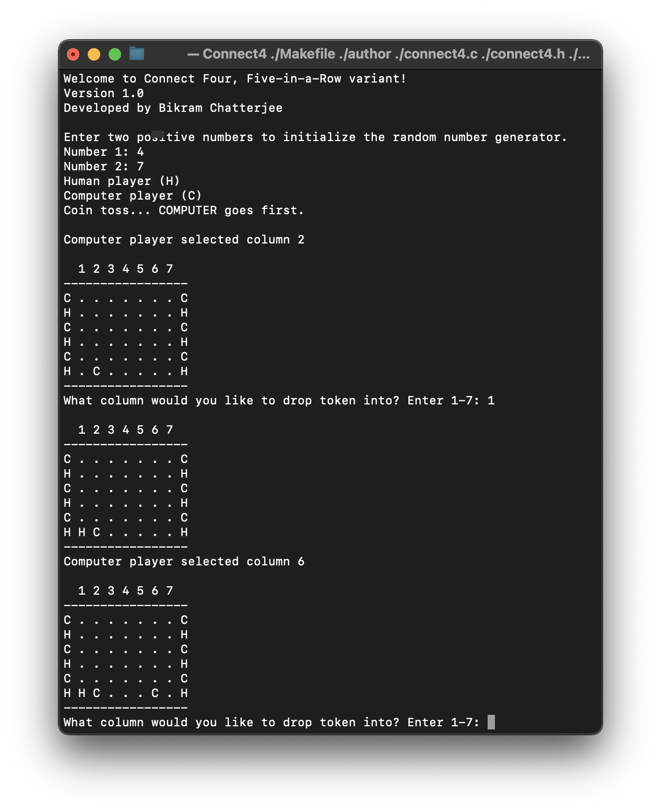

[![MIT License][license-shield]][license-url]
[![LinkedIn][linkedin-shield]][linkedin-url]
 
<h1 align='center'> Connect Four</h1>

Command line based Connect 4 game written in both C and MIPS

<h2 style="display: inline-block">Table of Contents</h2>

- [About The Project](#about)
- [License](#license)

<h2 id='about'>About The Project</h2>
This program was originally written in C and then completely converted to MIPS Assembly Language. In this game, the player is presented with a 9-column, 6-row board. At the beginning, the first and last columns are populated with alternating player tokens. The computer will randomly pick which player (the human or the computer) moves first.  That player drops their token into one of the middle 7 columns of the board. The next player then does the same thing.  At any point, if a player drops a token which completes a set of 5 tokens in a row (horizontally, vertically, or diagonally), that player wins the game.

<h2 id='license'>License</h2>

Distributed under the MIT License.

[license-shield]: https://img.shields.io/github/license/othneildrew/Best-README-Template.svg?style=for-the-badge
[license-url]: https://github.com/i0nics/connect-four-mips/blob/master/LICENSE
[linkedin-shield]: https://img.shields.io/badge/-LinkedIn-black.svg?style=for-the-badge&logo=linkedin&colorB=555
[linkedin-url]: https://linkedin.com/in/bikramce

